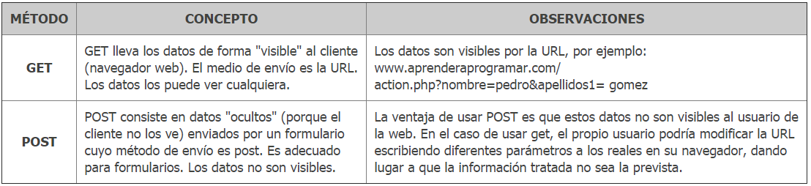
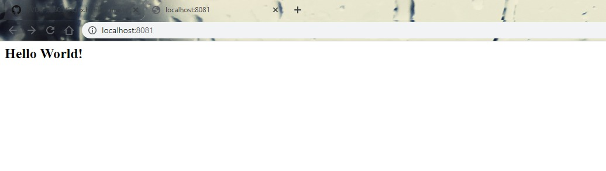
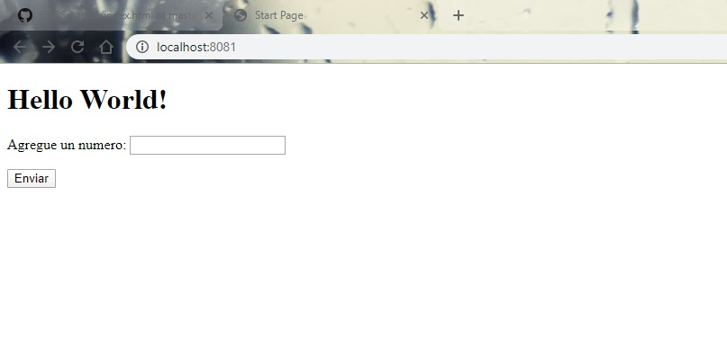
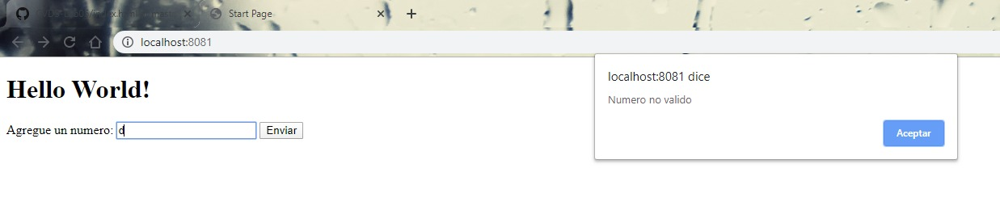
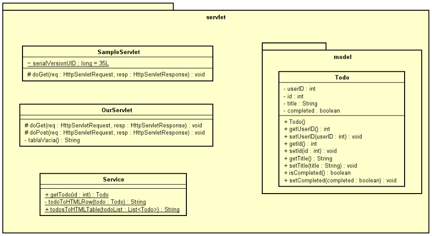


### Escuela Colombiana de Ingeniería

## Paola A. Cuellar - Laura A. Bernal  

### MVC Primefaces Introduction

### Introducción a proyectos Web

## Parte I. - Jugando a ser un cliente HTTP

3. Revise el resultado obtenido. ¿Qué código de error sale?
Sale el código de error 301, porque lo que se está solicitando se movió de forma permanente a otro espacio.
¿Qué otros códigos de error existen?, ¿En qué caso se manejarán?
1XXX Información
2XXX Éxito
3XXX Redireccionamiento
4XXX Error del Cliente
5XXX Error del Servidor

5. ¿Cuál es la diferencia entre los verbos GET y POST? ¿Qué otros tipos de peticiones existen?

[tomado de get y post HTML](https://www.aprenderaprogramar.com/index.php?option=com_content&view=article&id=527:get-y-post-html-method-formas-de-envio-de-datos-en-formulario-diferencias-y-ventajas-ejemplos-cu00721b&catid=69&Itemid=192)

6. ¿Cuáles son las diferencias con los diferentes parámetros?

~ **curl -V** Al usar el parámetro -v en el comando cURL, se habilita el modo detallado e imprimirá los detalles de el sitio de una forma completa  
~ **curl _I** Los encabezados HTTP permiten que el servidor web remoto realice el proceso de envió de información adicional sobre sí junto con la solicitud real, esto es usado para ofrecer al cliente detalles sobre cómo se está administrando la solicitud actual.

## Parte II.

4. Compile y ejecute la aplicación en el servidor embebido Tomcat, a través de Maven con:  
>mvn package  
>mvn tomcat7:run

## Parte III.

18. Cree un formulario que tenga un campo para ingresar un número y un botón.

20. Cambie el formulario para que ahora en lugar de POST, use el método GET.  
    ¿Qué diferencia observa?  
    Observamos que la diferencia entre el método POST y el método GET es que cuando hacemos la prueba con el método POST nos muestra detalles en la URL que en GET no son visibles.  

21. ¿Qué se está viendo? 
    Vemos el texto de hello world, junto con el campo donde se ingresa el número y el botón de "enviar".  

# Diagrama de Clases del proyecto 

## Parte IV. - Frameworks Web MVC – Java Server Faces / Prime Faces
## cambios

## CODAY

## CIRCLECI

